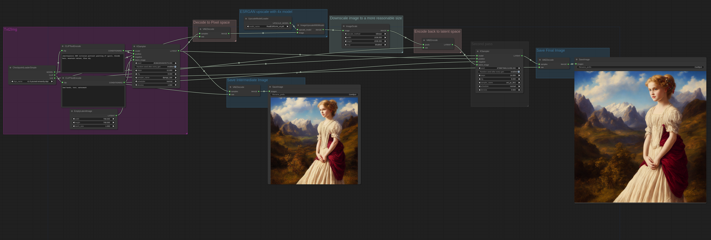
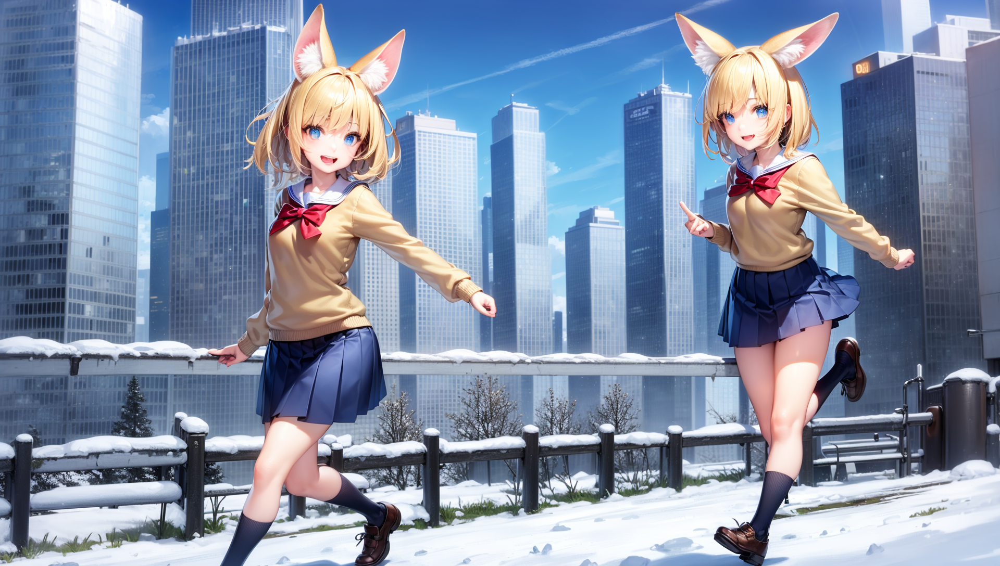

# 2 Pass Txt2Img (Hires fix) Examples

These are examples demonstrating how you can achieve the "Hires Fix" feature.

You can Load these images in [ComfyUI](https://github.com/comfyanonymous/ComfyUI) to get the full workflow.

Hires fix is just creating an image at a lower resolution, upscaling it and then sending it through img2img. Note that in ComfyUI txt2img and img2img are the same node. Txt2Img is achieved by passing an empty image to the sampler node with maximum denoise.

Here's a simple workflow in ComfyUI to do this with basic latent upscaling:

## Non latent Upscaling

Here is an example of how the [esrgan upscaler](../upscale_models) can be used for the upscaling step. Since ESRGAN operates in pixel space the image must be converted to pixel space and back to latent space after being upscaled.

## More Examples

Here is an example of a more complex 2 pass workflow, This image is first generated with the WD1.5 beta 3 illusion model, latent upscaled and then a second pass is done with cardosAnime_v10:

