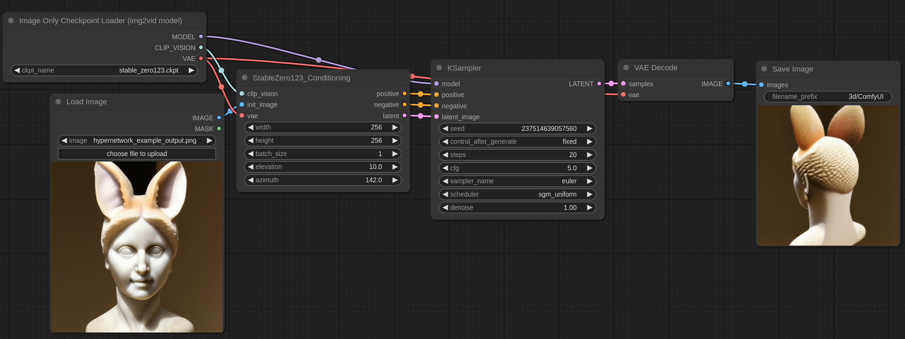

# 3D Examples

## Stable Zero123

Stable Zero123 is a diffusion model that given an image with an object and a simple background can generate images of that object from different angles.

[The checkpoint can be downloaded here](https://huggingface.co/stabilityai/stable-zero123/blob/main/stable_zero123.ckpt) Put it in the ComfyUI/models/checkpoints folder.

You can download this image and load it or drag it on [ComfyUI](https://github.com/comfyanonymous/ComfyUI) to get the workflow.

The input image can be found [here](../hypernetworks/hypernetwork_example_output.png), it is the output image from the [hypernetworks](../hypernetworks) example.

Elevation and asimuth are in degrees and control the rotation of the object.
