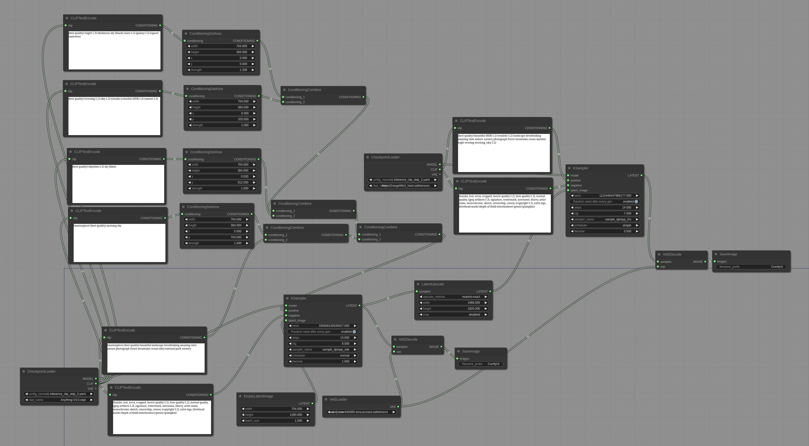
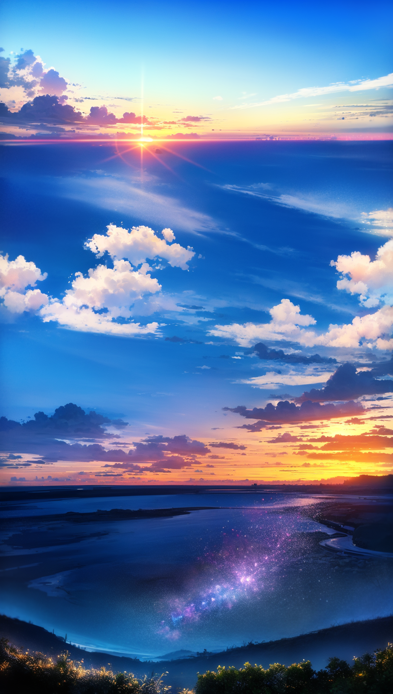
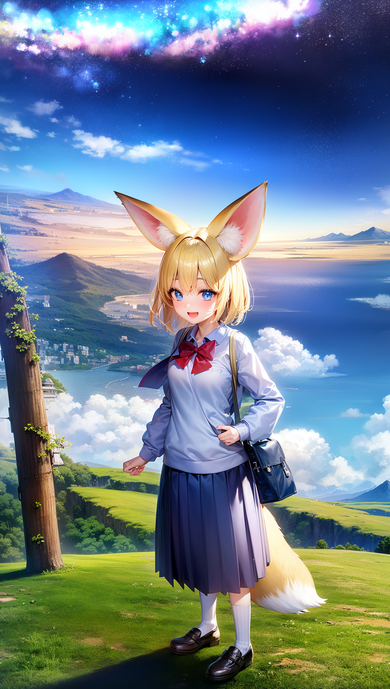
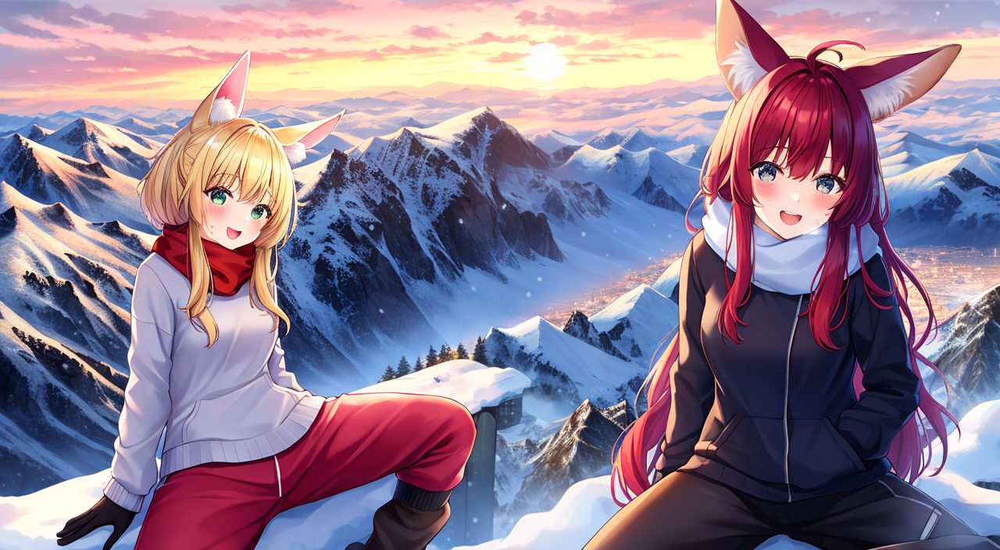
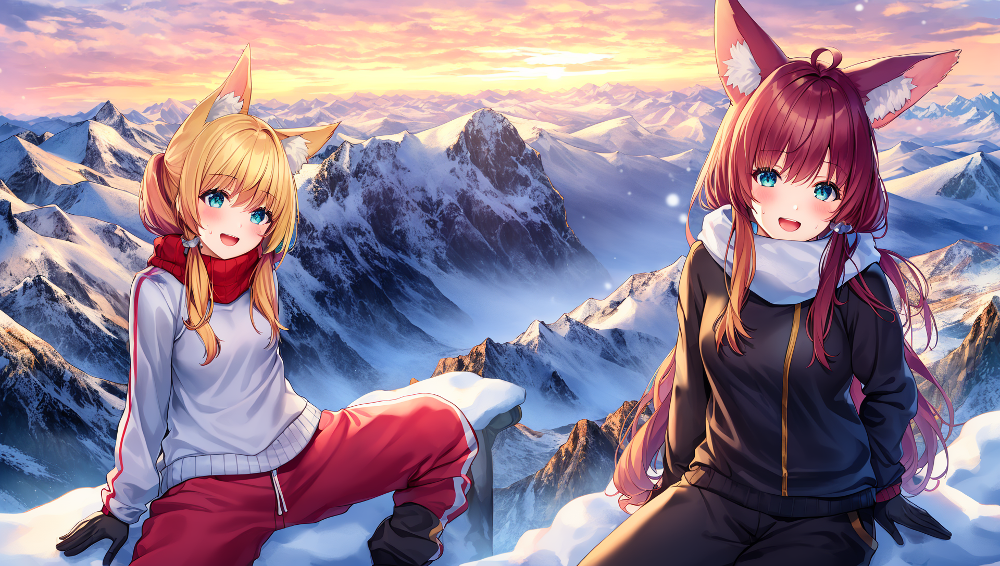

# Area Composition Examples

These are examples demonstrating the ConditioningSetArea node. You can Load these images in [ComfyUI](https://github.com/comfyanonymous/ComfyUI) to get the full workflow.

### Area composition with Anything-V3 + second pass with AbyssOrangeMix2_hard

This image contain 4 different areas: night, evening, day, morning

This is what the workflow looks like in ComfyUI:

This image contain the same areas as the previous one but in reverse order.

Adding a subject to the bottom center of the image by adding another area prompt.

## Increasing Consistency of images with Area Composition

Stable diffusion creates its most consistent images when generating square images with resolutions of close to 512x512. But what if we want to generate an image with a 16:9 aspect ratio?
Lets generate a 16:9 image with a sitting subject. If generated normally the success rate will be low with limbs extending unnaturally across the image and other consistency issues.

By using Area Composition with a square area for the subject the consistency will be higher and since it is generated as the same time as the rest of the image the consistency of the overall image will be excellent.

This workflow uses Anything-V3, it is a 2 pass workflow with area composition used for the subject on the first pass on the left side of the image. The reason for the second pass is only to increase the resolution, If you are fine with a 1280x704 image you can skip the second pass.

Adding a red haired subject with an area prompt at the right of the image.

First pass output (1280x704):

Second pass output (1920x1088):

This second pass output image illustrates one of the behaviors of Stable Diffusion. The second pass has no area prompts. You'll notice that the hair of subject 1 is blonde with pinkish highlights and subject 2 has pinkish hair instead of red hair unlike what was present in the first pass output. This is because Stable Diffusion tries to make the overall image consistent with itself and one of the side effects of that is merging the hair colors together.

