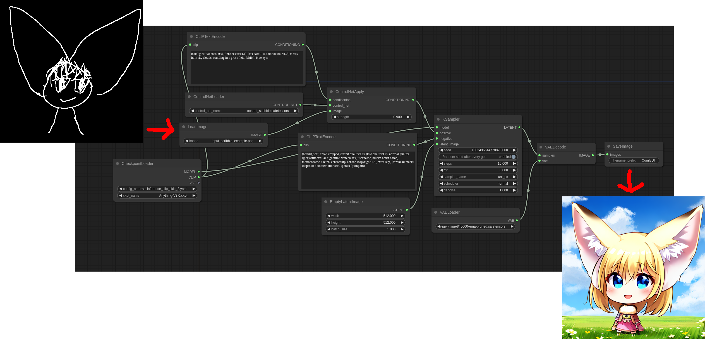
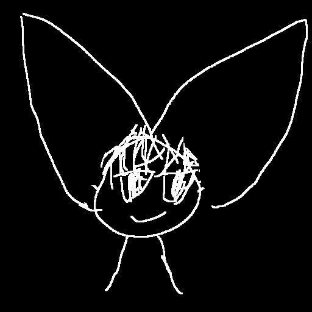
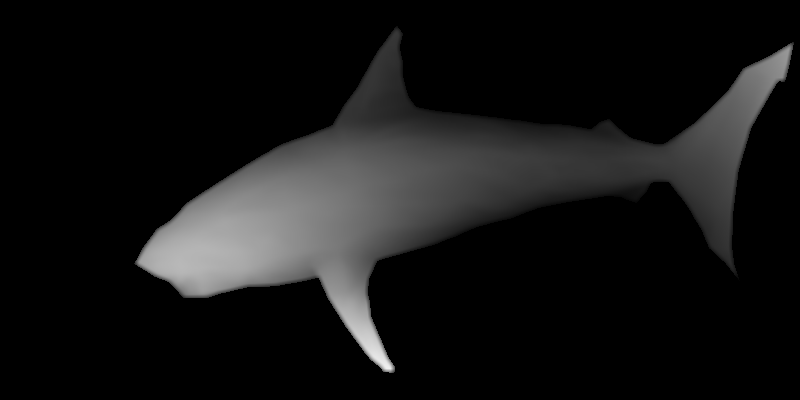
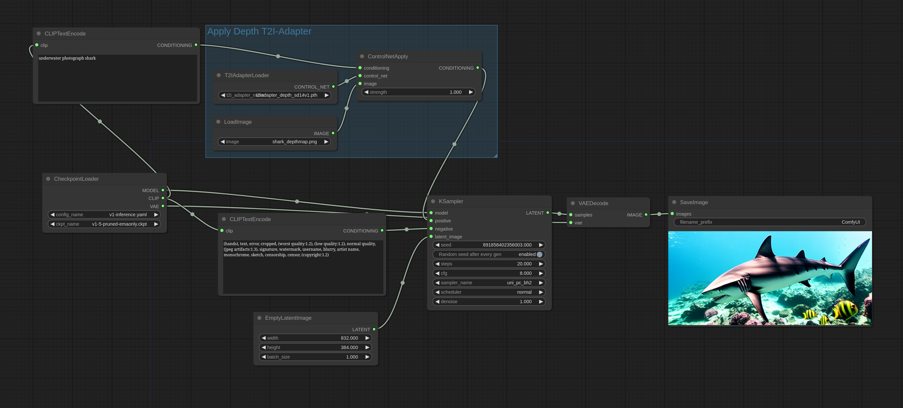
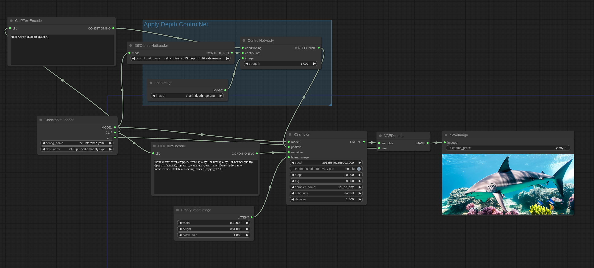
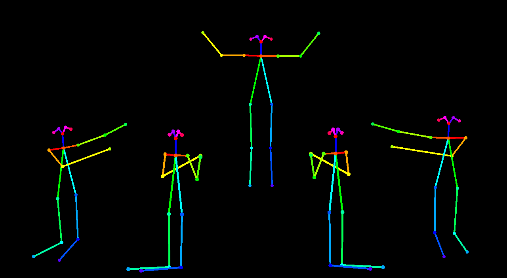
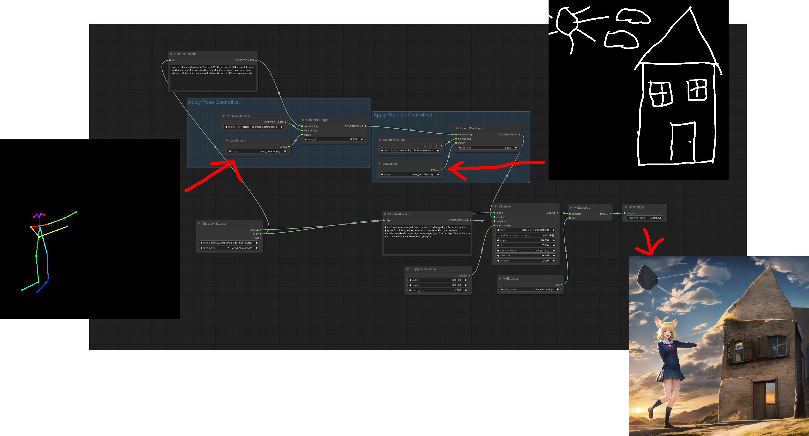
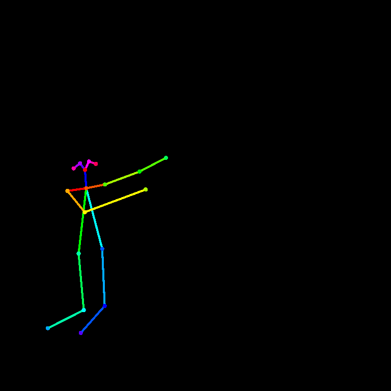
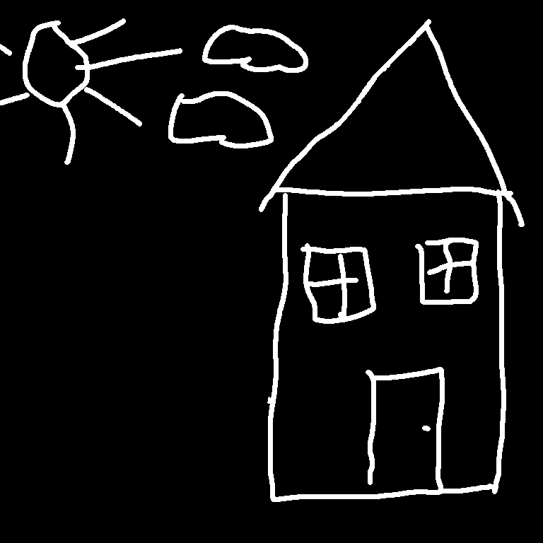

# ControlNet and T2I-Adapter Examples

Note that in these examples the raw image is passed directly to the ControlNet/T2I adapter.

Each ControlNet/T2I adapter needs the image that is passed to it to be in a specific format like depthmaps, canny maps and so on depending on the specific model if you want good results.

The ControlNetApply node will not convert regular images into depthmaps, canny maps and so on for you. You will have to do that separately or using nodes to preprocess your images that you can find: [Here](https://github.com/Fannovel16/comfyui_controlnet_aux)

You can find the latest controlnet model files here: [Original version](https://huggingface.co/lllyasviel/ControlNet-v1-1/tree/main) or [smaller fp16 safetensors version](https://huggingface.co/comfyanonymous/ControlNet-v1-1_fp16_safetensors/tree/main)

For SDXL stability.ai has released Control Loras that you can find [Here (rank 256)](https://huggingface.co/stabilityai/control-lora/tree/main/control-LoRAs-rank256) or [Here (rank 128)](https://huggingface.co/stabilityai/control-lora/tree/main/control-LoRAs-rank128). They are used exactly the same way (put them in the same directory) as the regular ControlNet model files.

ControlNet model files go in the ComfyUI/models/controlnet directory.

### Scribble ControlNet

Here's a simple example of how to use controlnets, this example uses the scribble controlnet and the AnythingV3 model. You can load this image in [ComfyUI](https://github.com/comfyanonymous/ComfyUI) to get the full workflow.

Here is the input image I used for this workflow:

### T2I-Adapter vs ControlNets

T2I-Adapters are much much more efficient than ControlNets so I highly recommend them. ControlNets will slow down generation speed by a significant amount while T2I-Adapters have almost zero negative impact on generation speed.

In ControlNets the ControlNet model is run once every iteration. For the T2I-Adapter the model runs once in total.

T2I-Adapters are used the same way as ControlNets in ComfyUI: using the ControlNetLoader node.

This is the input image that will be used in this example [source](https://commons.wikimedia.org/wiki/File:Stereogram_Tut_Shark_Depthmap.png):

Here is how you use the depth T2I-Adapter:

Here is how you use the depth Controlnet. Note that this example uses the DiffControlNetLoader node because the controlnet used is a diff control net. Diff controlnets need the weights of a model to be loaded correctly. The DiffControlNetLoader node can also be used to load regular controlnet models. When loading regular controlnet models it will behave the same as the ControlNetLoader node.

You can load these images in [ComfyUI](https://github.com/comfyanonymous/ComfyUI) to get the full workflow.

### Pose ControlNet

This is the input image that will be used in this example:

Here is an example using a first pass with AnythingV3 with the controlnet and a second pass without the controlnet with AOM3A3 (abyss orange mix 3) and using their VAE.

You can load this image in [ComfyUI](https://github.com/comfyanonymous/ComfyUI) to get the full workflow.

### Mixing ControlNets

Multiple ControlNets and T2I-Adapters can be applied like this with interesting results:

You can load this image in [ComfyUI](https://github.com/comfyanonymous/ComfyUI) to get the full workflow.

Input images:

&nbsp;&nbsp;&nbsp;&nbsp;&nbsp;&nbsp;&nbsp;&nbsp;

