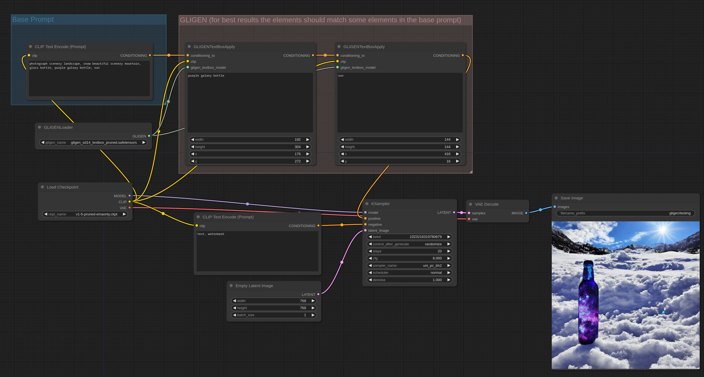

# GLIGEN Examples

Here is a link [to download pruned versions of the supported GLIGEN model files](https://huggingface.co/comfyanonymous/GLIGEN_pruned_safetensors/tree/main)

Put the GLIGEN model files in the ComfyUI/models/gligen directory.

### Text box GLIGEN

The text box GLIGEN model lets you specify the location and size of multiple objects in the image. To use it properly you should write your prompt normally then use the GLIGEN Textbox Apply nodes to specify where you want certain objects/concepts in your prompts to be in the image.

Is an example how to use it. You can load this image in [ComfyUI](https://github.com/comfyanonymous/ComfyUI) to get the workflow.

