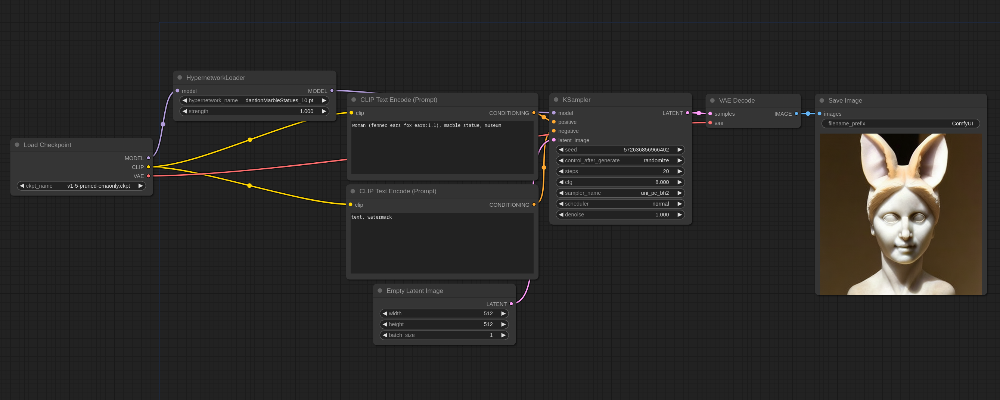

# Hypernetwork Examples

You can Load these images in [ComfyUI](https://github.com/comfyanonymous/ComfyUI) to get the full workflow.

Hypernetworks are patches applied on the main MODEL so to use them put them in the models/hypernetworks directory and use the Hypernetwork Loader node like this:

You can apply multiple hypernetworks by chaining multiple Hypernetwork Loader nodes in sequence.
