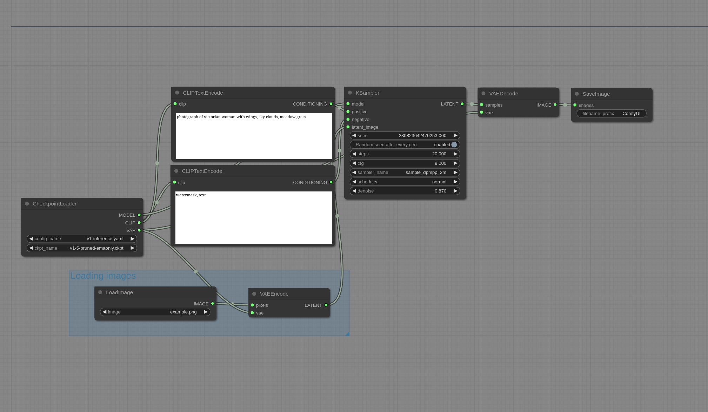

# Img2Img Examples

These are examples demonstrating how to do img2img.

You can Load these images in [ComfyUI](https://github.com/comfyanonymous/ComfyUI) to get the full workflow.

Img2Img works by loading an image like this [example image](https://github.com/comfyanonymous/ComfyUI/blob/master/input/example.png), converting it to latent space with the VAE and then sampling on it with a denoise lower than 1.0. The denoise controls the amount of noise added to the image. The lower the denoise the less noise will be added and the less the image will change.

Input images should be put in the input folder.

This is what a simple img2img workflow looks like, it is the same as the default txt2img workflow but the denoise is set to 0.87 and a loaded image is passed to the sampler instead of an empty image.

