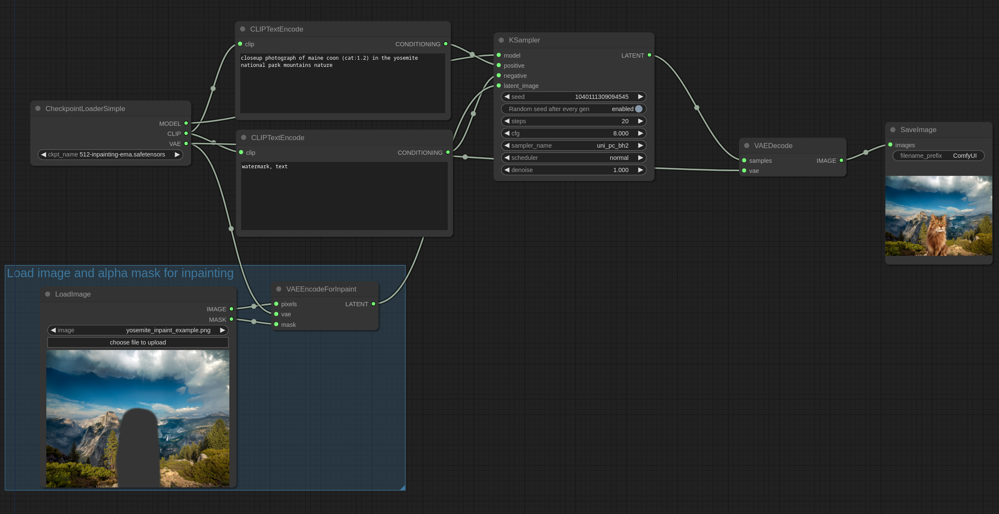

# Inpaint Examples

In this example we will be using this image. Download it and place it in your input folder.

This image has had part of it erased to alpha with gimp, the alpha channel is what we will be using as a mask for the inpainting. If using GIMP make sure you save the values of the transparent pixels for best results.

ComfyUI also has a mask editor that can be accessed by right clicking an image in the LoadImage node and "Open in MaskEditor".

The following images can be loaded in [ComfyUI](https://github.com/comfyanonymous/ComfyUI) to get the full workflow.

Inpainting a cat with the v2 inpainting model:

Inpainting a woman with the v2 inpainting model:

It also works with non inpainting models. Here's an example with the anythingV3 model:

### Outpainting

You can also use similar workflows for outpainting. Outpainting is the same thing as inpainting. There is a "Pad Image for Outpainting" node to automatically pad the image for outpainting while creating the proper mask. In this example this image will be outpainted:

Using the v2 inpainting model and the "Pad Image for Outpainting" node (load it in ComfyUI to see the workflow):

