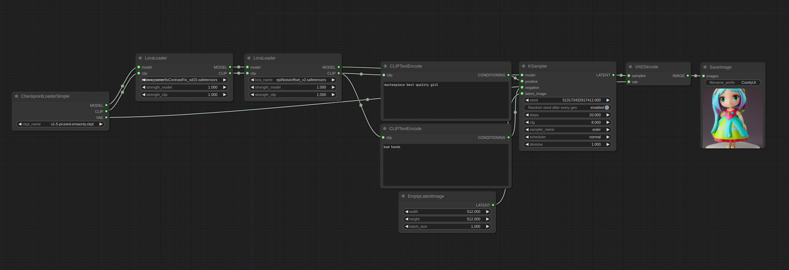

# Lora Examples

These are examples demonstrating how to use Loras. All LoRA flavours: Lycoris, loha, lokr, locon, etc... are used this way.

You can Load these images in [ComfyUI](https://github.com/comfyanonymous/ComfyUI) to get the full workflow.

Loras are patches applied on top of the main MODEL and the CLIP model so to use them put them in the models/loras directory and use the LoraLoader node like this:

You can apply multiple Loras by chaining multiple LoraLoader nodes like this:

