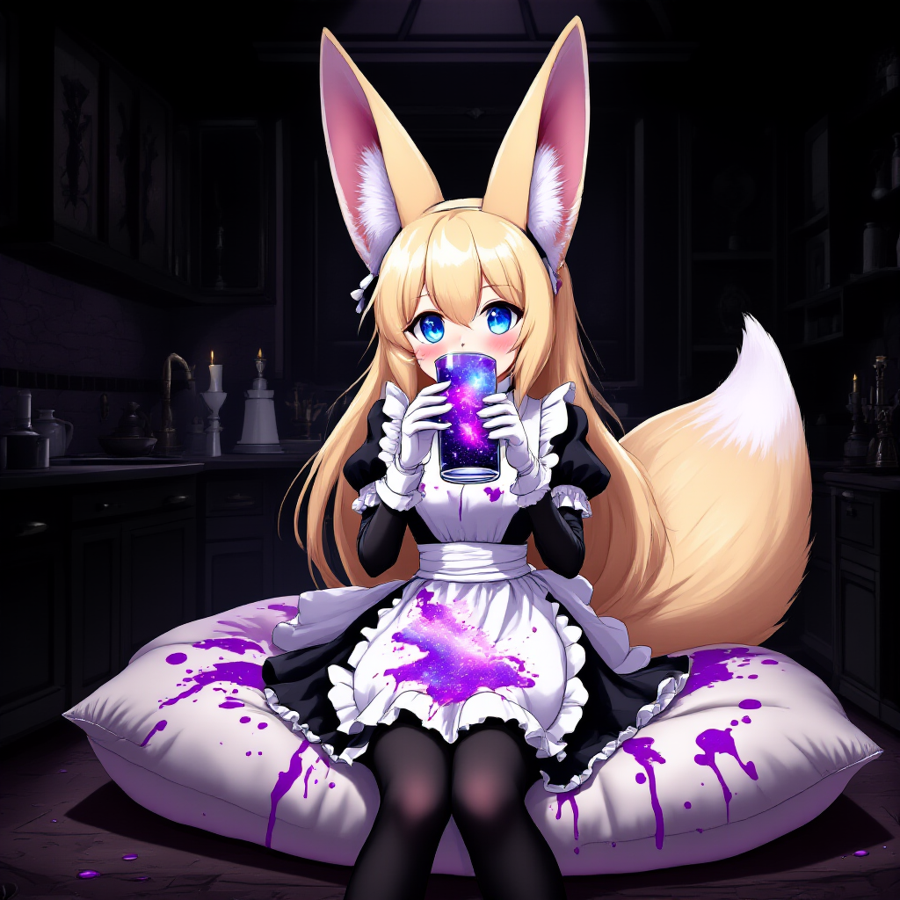

# Lumina Image 2.0

[Lumina Image 2.0](https://github.com/Alpha-VLLM/Lumina-Image-2.0) is a interesting diffusion model that uses gemma 2 2B for its text encoder.

## Basic Workflow

Download [lumina_2.safetensors](https://huggingface.co/Comfy-Org/Lumina_Image_2.0_Repackaged/blob/main/all_in_one/lumina_2.safetensors) and put it in your ComfyUI/checkpoints directory.

You can then load up the following image in ComfyUI to get the workflow:

