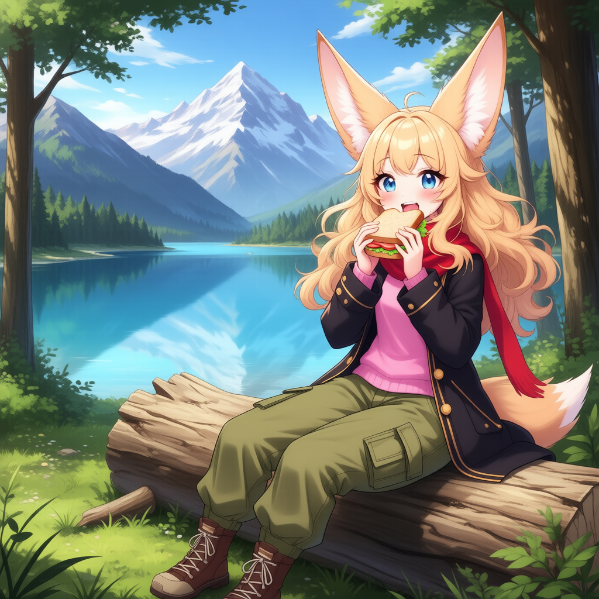
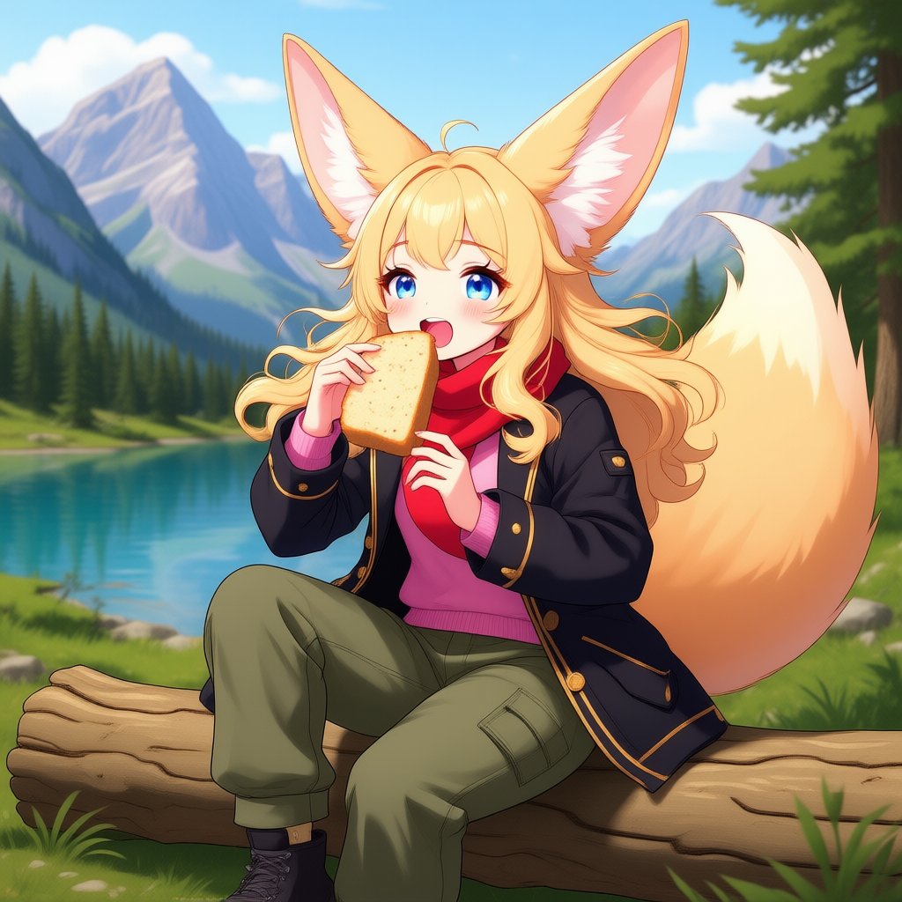

# Qwen Image

[Qwen Image](https://github.com/QwenLM/Qwen-Image) is a 20B diffusion model.

## Basic Workflow

Download [qwen_image_fp8_e4m3fn.safetensors](https://huggingface.co/Comfy-Org/Qwen-Image_ComfyUI/blob/main/split_files/diffusion_models/qwen_image_fp8_e4m3fn.safetensors) and put it in your ComfyUI/models/diffusion_models directory.

[qwen_2.5_vl_7b_fp8_scaled.safetensors](https://huggingface.co/Comfy-Org/Qwen-Image_ComfyUI/blob/main/split_files/text_encoders/qwen_2.5_vl_7b_fp8_scaled.safetensors) and put it in your ComfyUI/models/text_encoders directory.

[qwen_image_vae.safetensors](https://huggingface.co/Comfy-Org/Qwen-Image_ComfyUI/blob/main/split_files/vae/qwen_image_vae.safetensors) and put it in your ComfyUI/models/vae/ directory

You can then load up or drag the following image in ComfyUI to get the workflow:

## Edit Model v2509

Make sure you downloaded the text encoder and vae files for the basic workflow above. This model supports up to 3 different image inputs.

Download [qwen_image_edit_2509_fp8_e4m3fn.safetensors](https://huggingface.co/Comfy-Org/Qwen-Image-Edit_ComfyUI/blob/main/split_files/diffusion_models/qwen_image_edit_2509_fp8_e4m3fn.safetensors) and put it in your ComfyUI/models/diffusion_models directory.

You can then load up or drag the following image in ComfyUI to get the workflow:

You can find the input image [here](../chroma/fennec_girl_sing.png)

## Edit Model (older first version)

Make sure you downloaded the text encoder and vae files for the basic workflow above.

Download [qwen_image_edit_fp8_e4m3fn.safetensors](https://huggingface.co/Comfy-Org/Qwen-Image-Edit_ComfyUI/blob/main/split_files/diffusion_models/qwen_image_edit_fp8_e4m3fn.safetensors) and put it in your ComfyUI/models/diffusion_models directory.

You can then load up or drag the following image in ComfyUI to get the workflow:

You can find the input image [here](../chroma/fennec_girl_sing.png)
