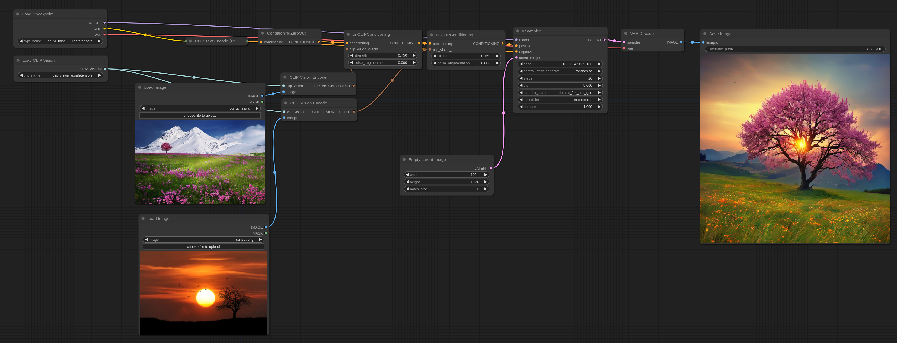
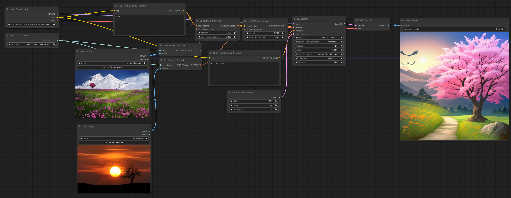

# SDXL Examples

The SDXL base checkpoint can be used like any regular checkpoint in [ComfyUI](https://github.com/comfyanonymous/ComfyUI). The only important thing is that for optimal performance the resolution should be set to 1024x1024 or other resolutions with the same amount of pixels but a different aspect ratio.
For example: 896x1152 or 1536x640 are good resolutions.

For using the base with the refiner you can use this workflow. You can download this image and load it or drag it on ComfyUI to get it.

You can also give the base and refiners different prompts like on this workflow.

### ReVision

ReVision is very similar to [unCLIP](../unclip) but behaves on a more conceptual level. You can pass one or more images to it and it will take concepts from the images and will create new images using them as inspiration.

First download [CLIP-G Vision](https://huggingface.co/comfyanonymous/clip_vision_g/blob/main/clip_vision_g.safetensors) and put in in your ComfyUI/models/clip_vision/ directory.

Here is an example workflow that can be dragged or loaded into ComfyUI. In this following example the positive text prompt is zeroed out in order for the final output to follow the input image more closely.

If you want to use text prompts you can use this example:

Note that the strength option can be used to increase the effect each input image has on the final output. It also works with an arbitrary number of images by either using a single unCLIPConditioning or chainning more than one together like in the above examples.

Here are the input images for the above workflows if you need them:

&nbsp;&nbsp;&nbsp;&nbsp;&nbsp;&nbsp;&nbsp;&nbsp;
