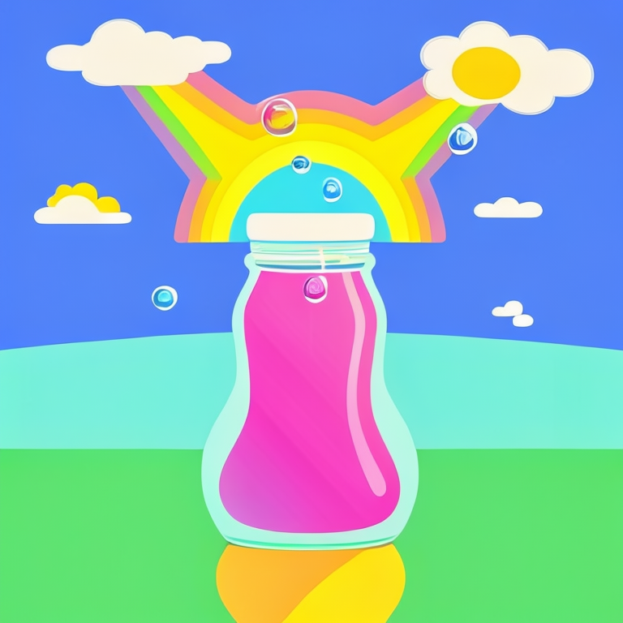
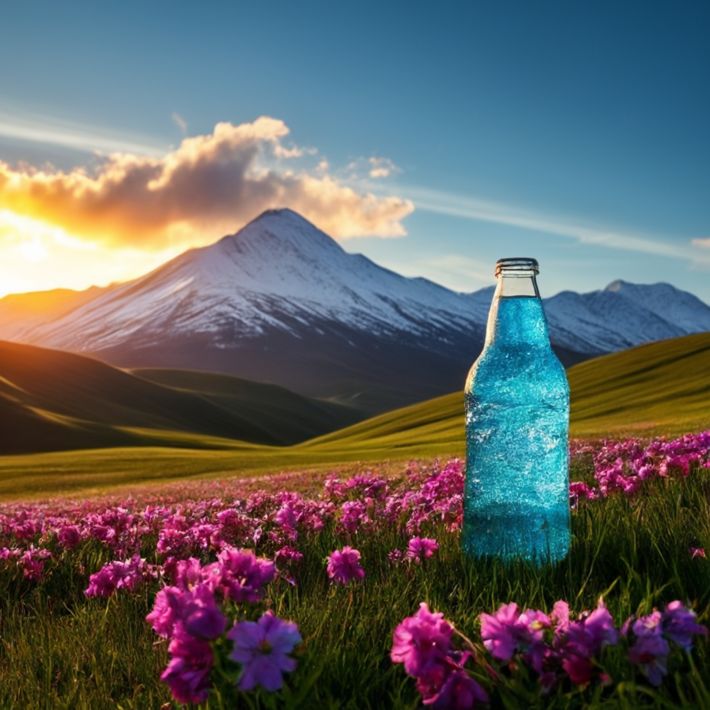

# Stable Cascade Examples

First download the [stable_cascade_stage_c.safetensors and stable_cascade_stage_b.safetensors checkpoints](https://huggingface.co/stabilityai/stable-cascade/tree/main/comfyui_checkpoints) and put them in the ComfyUI/models/checkpoints folder.

Stable cascade is a 3 stage process, first a low resolution latent image is generated with the Stage C diffusion model. This latent is then upscaled using the Stage B diffusion model. This upscaled latent is then upscaled again and converted to pixel space by the Stage A VAE.

Note that you can download all images in this page and then drag or load them on ComfyUI to get the workflow embedded in the image.

## Text to Image

Here is a basic text to image workflow:

## Image to Image

Here's an example of how to do basic image to image by encoding the image and passing it to Stage C.

## Image Variations

Stable Cascade supports creating variations of images using the output of CLIP vision. See the following workflow for an example:

See this next workflow for how to mix multiple images together:

You can find the input image for the above workflows on the [unCLIP example page](../unclip)

