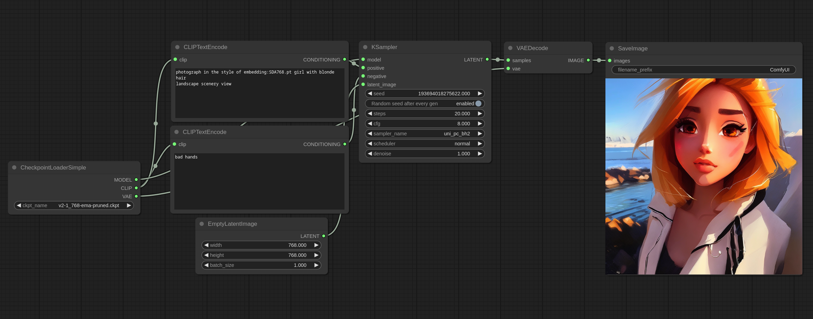

# Textual Inversion Embeddings Examples

Here is an example for how to use Textual Inversion/Embeddings.



To use an embedding put the file in the models/embeddings folder then use it in your prompt like I used the SDA768.pt embedding in the previous picture.

Note that you can omit the filename extension so these two are equivalent:

```embedding:SDA768.pt```

```embedding:SDA768```

Embeddings are basically custom words so where you put them in the text prompt matters.


For example if you had an embedding of a cat:

```red embedding:cat```

This would likely give you a red cat.

