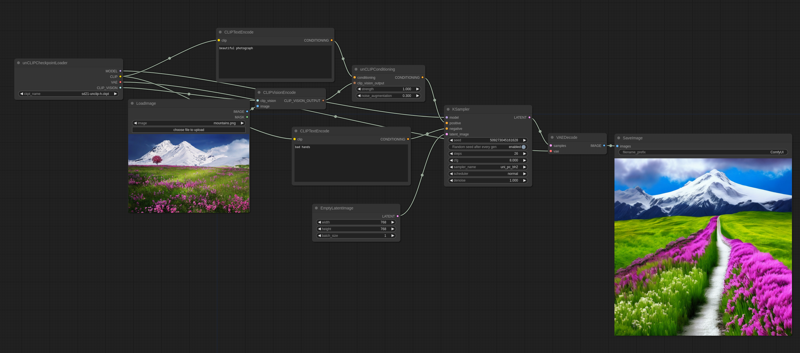
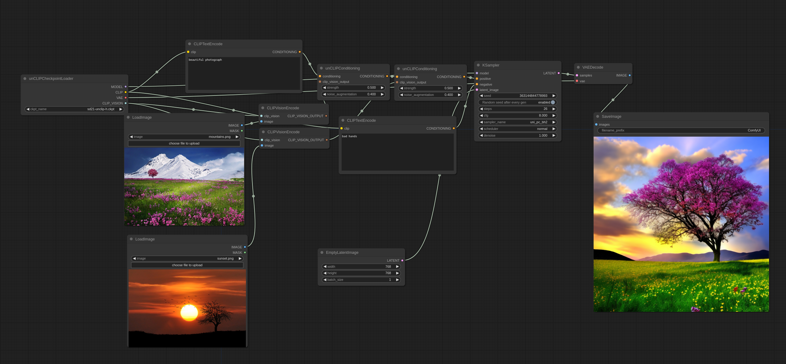

# unCLIP Model Examples

unCLIP models are versions of SD models that are specially tuned to receive image concepts as input in addition to your text prompt. Images are encoded using the CLIPVision these models come with and then the concepts extracted by it are passed to the main model when sampling.

It basically lets you use images in your prompt.

Here is how you use it in ComfyUI (you can drag this into ComfyUI to get the workflow):

noise_augmentation controls how closely the model will try to follow the image concept while strength is how strong it is actually applied.

Multiple images can be used like this:

You'll notice how it doesn't blend the images together in the traditional sense but actually picks some concepts from both and makes a coherent image.

Input images:

&nbsp;&nbsp;&nbsp;&nbsp;&nbsp;&nbsp;&nbsp;&nbsp;

You can find the official unCLIP checkpoints [here](https://huggingface.co/stabilityai/stable-diffusion-2-1-unclip/tree/main)

You can find some unCLIP checkpoints I made from some existing 768-v checkpoints with some clever merging [here (based on WD1.5 beta 2)](https://huggingface.co/comfyanonymous/wd-1.5-beta2_unCLIP/tree/main) and [here (based on illuminati Diffusion)](https://huggingface.co/comfyanonymous/illuminatiDiffusionV1_v11_unCLIP/tree/main)
